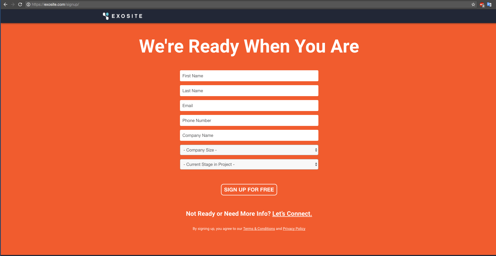
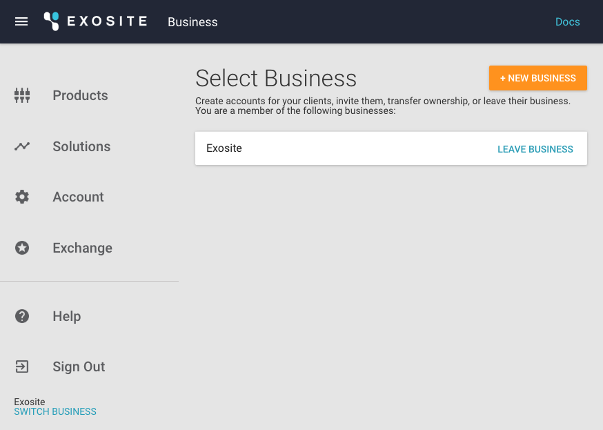
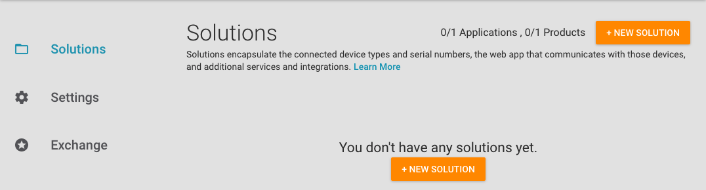
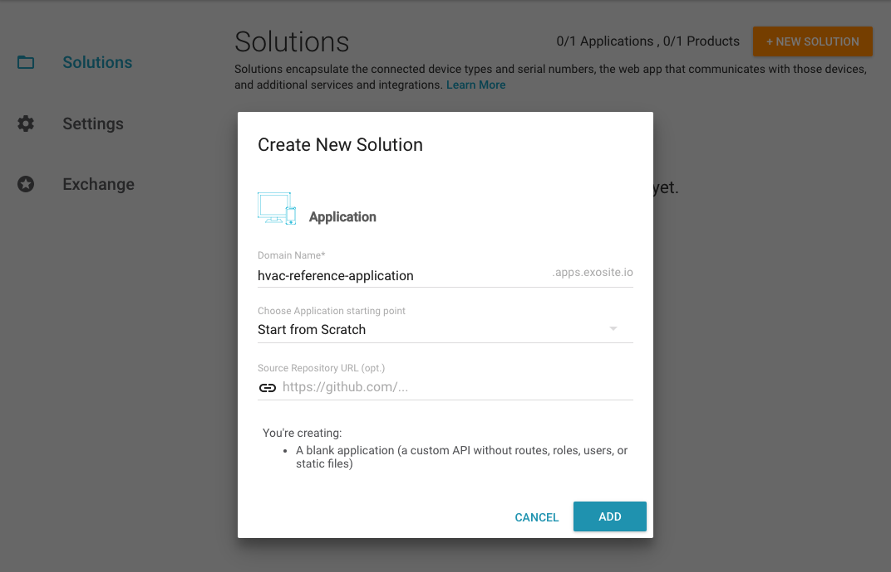
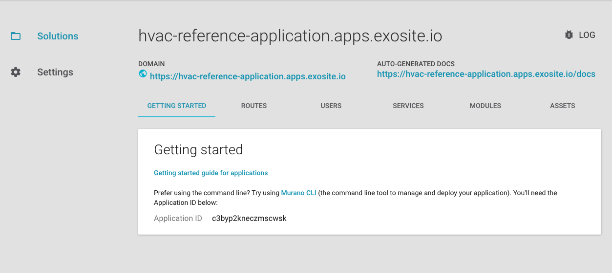
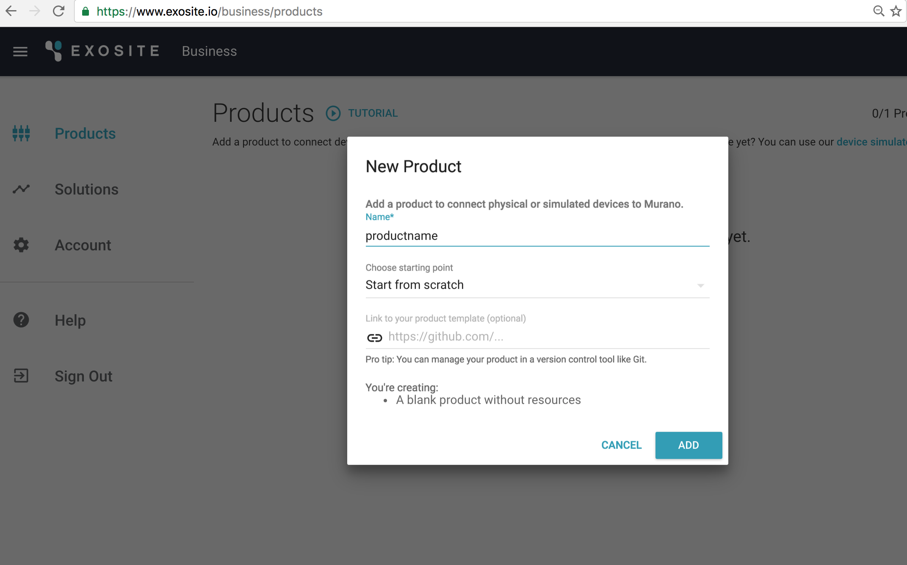
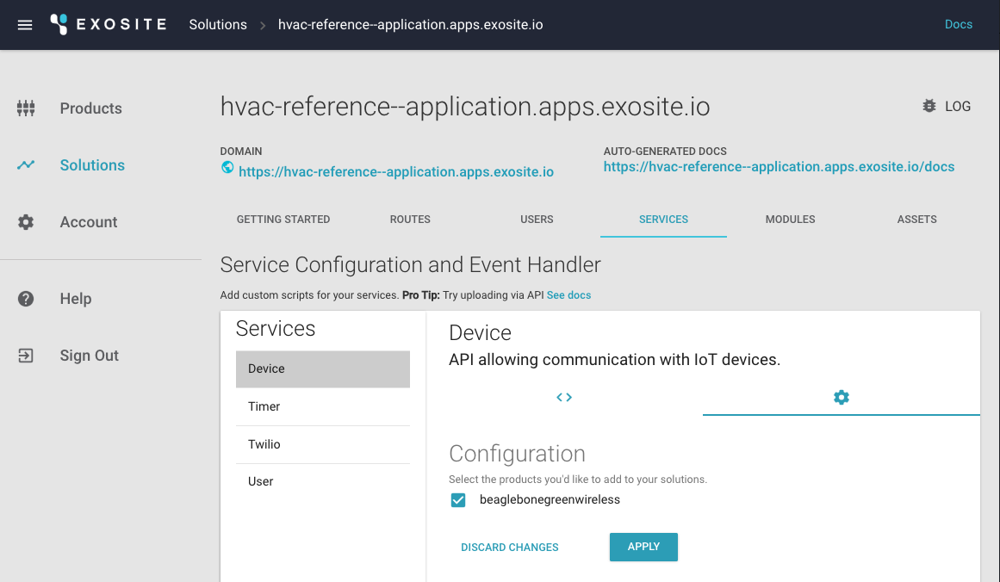
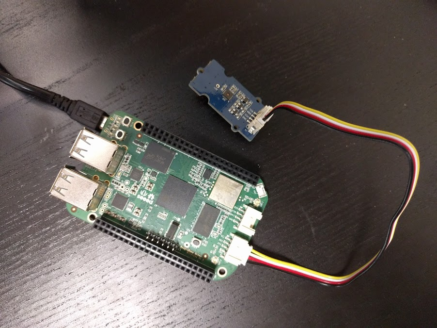

# HVAC Reference Application Tutorial

This HVAC Reference Application is an interactive tutorial that allows users to learn the core features of Murano from both a hardware and software perspective. You will have the option to prototype or simulate the implementation of an HVAC monitoring system with simple controls using the Murano platform. This tutorial is intended for users who have some development or software experience. If you are unsure about the steps in the tutorial, are stuck getting something to work, or simply have quesitons, please get a hold of us by posting on [our community forum](https://community.exosite.com) or by emailing us at [support@exosite.com](mailto:support@exosite.com).

# Requirements
This tutorial is designed to be flexible based the hardware, software, and tools you have available. If you have one of the supported hardware items, you will be able to create a full IoT solution with working hardware. If you do not have any of the supported hardware available, we have created a Python based simulator that will help you get started.

## Supported Hardware

### SeeedStudio BeagleBone Green Wireless

[https://beagleboard.org/green-wireless](https://beagleboard.org/green-wireless)

SeeedStudio BeagleBone Green Wireless (BBGW) is a low-cost, open-source, community-supported development platform for developers and hobbyists. It is a joint effort by BeagleBoard.org and Seeed Studio. It is based on the classical open-source hardware design of BeagleBone Black and has been developed into this differentiated version. The BBGW includes two Grove connectors, making it easier to connect to the large family of Grove sensors. The onboard HDMI is removed to make room for these Grove connectors.

[http://wiki.seeed.cc/BeagleBone_Green/](http://wiki.seeed.cc/BeagleBone_Green/) 

## Software

### Git (required)

Git is required to check out the source code used in this tutorial. Git is a source control tool widely used in the software industry. 

To install Git on your computer, please visit the link below and follow the instructions.

[https://git-scm.com/downloads](https://git-scm.com/downloads)

### Web Browser (required)

You'll need a web browser for the initial steps in this tutorial.

### Python

All code written for the simulator in this tutorial has been written to work with Python 2 and 3. Both of these versions of Python can be downloaded from the [Python website](https://www.python.org/).

### Murano CLI

Murano CLI is a command-line utility for working with Murano. Think of it as a way to simplify and automate tasks for those who are comfortable with their machine's command-line interface. 

[https://github.com/exosite/MuranoCLI](https://github.com/exosite/MuranoCLI#murano-command-line-interface-cli)

# Getting Started

In this section you will walk through the process of setting up your account with Murano and preparing to connect your hardware or run the simulator.

## Create an Account

To get started with this tutorial, you will need to create an Exosite account using your web browser of choice. 

1. If you do not have an Exosite account, you can sign up here ([https://exosite.com/signup/](https://exosite.com/signup/)).

   

## Create a Business

1. Once you have an active account and have logged in, you can navigate to the following URL to see your newly created Business [https://www.exosite.io/business/memberships](https://www.exosite.io/business/memberships).

   
   
## Install the Murano CLI

Exosite offers a command line tool that allows you to efficiently work with the project in this tutorial. Even though everything in this tutorial can be accomplished using a the Web UI, feel free to install the Murano CLI.

```
Murano CLI is the command-line tool that interacts with Murano and makes tasks easier. Murano CLI makes it simple to deploy code to a solution, import many product definitions at once, set up endpoints and APIs, and more. 
```

Murano CLI is a Ruby based command-line interface. Murano CLI can be used for most actions throughout the rest of this tutorial.

Ruby is most likely already installed on your system. Check to see if Ruby is installed first by opening up a terminal window and typing the following command.  

**Note:** Always copy and paste what comes after the $.

If you are running Windows, you can opt to use the [MuranoCLI-Setup.exe](https://github.com/exosite/MuranoCLI/releases) to install
the CLI as a single Windows executable.

```sh
$ which gem
```

If you see something like `/usr/bin/gem`, then Ruby is already installed. 

```
If you do not have Ruby installed, the official Ruby docs will help you get it installed:
[https://www.ruby-lang.org/en/documentation/installation/](https://www.ruby-lang.org/en/documentation/installation/) 
```

Once Ruby is installed, install Murano CLI by running this command:

```sh
$ sudo gem install MuranoCLI
```

If prompted, please enter your local computer password.

## Check out the HVAC demo code

Git is required for this next step. You can check if Git is installed by running the command: 

```sh
$ which git
```

If you do not have Git installed, the official Git docs will help you get it installed: [https://git-scm.com/book/en/v2/Getting-Started-Installing-Git](https://git-scm.com/book/en/v2/Getting-Started-Installing-Git)

In a terminal window, navigate to your development working directory and execute the following:

```sh
$ git clone https://github.com/exosite/hvac-reference-application.git
```

Enter your GitHub username and password if prompted.

Run this command:

```sh
$ cd hvac-reference-application
```

## Create a Solution

Next you need to create a Solution so you can deploy the HVAC tutorial web application on Murano. You can do this using the Web UI or the Murano CLI.

### Web UI

To create a Solution using the Web UI:

1. From the [*Solutions* tab](https://www.exosite.io/business/solutions), click "+ NEW SOLUTION." 

   

2. Select *Start from scratch* and click the "ADD" button.

   

Once you have created a solution, you will need to find the Solution ID.

1. In Murano select *Solutions*.

2. Select the Solution you just created.

3. Copy the Solution ID on this page.

   

### Murano CLI (alternate method)

To create a Solution using the Murano CLI:

```sh
$ murano solution create <name> --save
```

This command will return the ID of your Solution and save it to the Murano CLI config file.

## Create a Product

Next, you will need to create a Product. The Product you create is the virtual representation of the BBGW’s physical hardware and sensors that will send data to the Murano platform. This can be done using the Web UI or the Murano CLI.

### Web UI

To create a new Product using the Web UI:

1. Navigate to the following URL: 
   [https://www.exosite.io/business/products](https://www.exosite.io/business/products)

   

1. Click on "+ NEW PRODUCT." 

1. Name your Product. Note: Your Product name cannot contain any capital letters. 

1. Open the *Choose Starting Point* dropdown, select *Start from scratch*, and click the "ADD" button. In the next step you can use code to configure your Product.

   

Before continuing you will need to find the ID of the Product you created.

1. In Murano select *Products*.

2. Select the Product you just created.

3. Copy the Product ID on this page.

   


### Murano CLI (alternate method)

To create a new Product using the Murano CLI:

```sh
$ murano product create <name> --save
```

This command will return the ID of your Product for the next step.

## Configure your Product

You will need to teach Murano about the resources that this tutorial will use. This can be done by hand in the Web UI, but it is much easier to use the MuranoCLI. Executing the command below will set the Product definition for this tutorial as defined in the `specs/resources.yaml` file. 

```sh
$ murano syncup --specs
```

This command sets up all of the resources aliases that the tutorial device code or simulator will write to and read data from. After this command is run, you should see these resources by going to [https://www.exosite.io/business/products](https://www.exosite.io/business/products) and clicking the 'Definition' tab. Many of the aliases are used by Exosite's over-the-air-update framework Gateway Engine. If you would like to read more about this software you can on [GWE's documentation page](http://docs.exosite.com/development/exositeready/gwe/). For this tutorial, pay special attention to the aliases 'ambient_temperature', 'desired_temperature', and 'heat_on'. These are all the different resources that are used by the sensor application or device simulator. 

## Connect your Product to your Solution

Next, you will need to link your Product with your Solution. Linking allows your Solution and Product to communicate with one another. Without this link, your device's data will not be displayed in your deployed web application.

### Web UI

1. In your Murano Solution, click on the *SERVICES* tab. 

2. Select *Product*.

3. Select the settings icon. 

4. Select the Product that you created earlier.

5. Click "APPLY".

   

### Murano CLI (alternate method)

To connect a Product with a Solution using the Murano CLI:

```sh
$ murano assign set
```

## Sync your Solution

Before moving on to hardware or the simulator, all of the Solution configuration needs to be synced up to Murano.

```sh
$ murano syncup --verbose
```

```
What is happening when you sync code?

Murano CLI looks at the directory structure of your local repository and syncs the appropriate files and configurations directly to your Solution in Murano. Endpoints, event handles, static files, and modules are synced. If you make changes locally, a syncup command will ensure Murano matches your local changes. If you make changes using the Murano interface, a syncdown will ensure your local repository matches Murano.
```

At this point both your Product and Solution are configured and ready to start receiving data. You can see the Solution interface at this point by clicking the DOMAIN link on the Solution page.

## Next Steps

If you have hardware available, you can walk through installing required software on your hardware, connecting the hardware and its sensors to the Murano platform, and connecting the sensor data to a Murano Solution.

If you do not have hardware available, you can walk through running the simulator. 

Either of these options should provide you with an easy starting point for storing device data in Exosite Murano. 

# BeagleBone Green Wireless

This portion of the tutorial with help you get your BeagleBone Green Wireless connected to the Solution you have already deployed.

# Requirements

## Hardware Setup

### SeeedStudio BeagleBone Green Wireless

[https://beagleboard.org/green-wireless](https://beagleboard.org/green-wireless)

SeeedStudio BeagleBone Green (BBGW) is a low-cost, open-source, community-supported development platform for developers and hobbyists. It is a joint effort by BeagleBoard.org and Seeed Studio. It is based on the classical open-source hardware design of BeagleBone Black and has been developed into this differentiated version. The BBGW includes two Grove connectors, making it easier to connect to the large family of Grove sensors. The onboard HDMI is removed to make room for these Grove connectors.

[http://wiki.seeed.cc/BeagleBone_Green/](http://wiki.seeed.cc/BeagleBone_Green/) 

## Software Setup 

### Gateway Engine with GMQ

ExositeReady™ Gateway Engine (GWE) is a Python-based application framework that runs on embedded Linux gateway devices. GWE makes it easy to connect devices to a gateway, write applications on that gateway to interact with Exosite web services, and to deploy over-ther-air-updates to a gateway. 

In this example you will use GWE to allow sensors to communicate with the Murano platform. Installation instructions are provided in a later section.

```
Gateway Engine will be used to, manage the tutorial application's identity, provision with Murano's device API, and activate your physical hardware.
```
# BeagleBone Setup

Plug in your BBGW and sensor as shown below:

   

Using a smartphone or computer:

1.  Go to your Wi-Fi settings.

2.  Connect to the Wi-Fi signal named "Beaglebone <xxxx>".

3.  Follow the instructions on the screen to connect the BBGW to your Wi-Fi network.

4.  Write down your BBGW's IP address when the screen below is shown:

   
   
   

Note: It is okay if it takesa few minutes to connect to the BBGW. It has some services on itself to startup first. You will know that the device is properly broadcasting its Wi-Fi network when the LEDs by the power cable begin to blink back and forth. LEDs D2 and D4 will alternate with LEDs D3 and D5.

The BBGW does not come with all the tools needed for reading sensors connected to it. Some initial software setup is required to send sensor data to Exosite. This setup can be done from a shell on the BBGW itself.

To connect directly to the BBGW, you can use ssh. At this point you can update the board to install a few needed libraries. 

```sh
$ ssh debian@<IP Address>
$ sudo apt-get update && sudo apt-get upgrade
```
Note: This update can take some time to complete. There are a large amount of updates that will take place.

After the upgrade completes, please restart the BBGW before continuing the setup process.

```sh
$ sudo reboot
```

After the reboot, ssh back into the BBGW to finish upgrading libraries.

```sh
$ ssh debian@<IP Address>
$ sudo pip install pip --upgrade
$ sudo pip install Adafruit_BBIO --upgrade
$ sudo pip install pyserial --upgrade
$ sudo apt-get install python-smbus
```

## Install GWE with GMQ on BeagleBone

Next install GWE on the BBGW. 

```
What is GWE?

In the context of IoT, a "gateway" can be defined as any device that serves as a communication broker for other devices. Gateways, in this context, often bridge the gap between an IoT platform (Exosite) and some collection of devices that do not possess the ability to communicate on the Internet. Sometimes the devices generating the data you want on the Internet are not devices, per se, but data from other networks the gateway can access such as modbus and CAN. Either way, the purpose of any gateway is to move local data to an external agent on the Internet.

Since using gateways is common throughout so many industrial applications, Exosite created Gateway Engine as an out-of-the-box developer and deployment tool for Internet-connected gateways.

For more information, check out the GWE docs site [http://docs.exosite.com/gwe/](http://docs.exosite.com/gwe/).
```

First write down the MAC address of the BBGW for use later in the tutorial.

```sh
$ ssh <USER>@<IP Address> "ifconfig -a"
```

To download the latest version of the Public Release of GWE, follow these steps:

Navigate to the [Gateway Engine Release Packages section on Exosite GWE documentation page](http://docs.exosite.com/development/exositeready/gwe/release_packages/) and follow the instructions to download GWE.

Now, GWE should be on your developer machine, you will need to transfer it over to the BBGW.

Run these commands to copy GWE to your gateway (the actual filename in the command may differ):

```sh
$ ssh root@<IP Address> "mkdir /opt"
$ scp GatewayEngine.v1-1-2.tar.gz root@<IP Address>:/opt
```

If you have trouble with this step. Consider making a directory that your user account on the BBGW has access to, then ```scp``` GWE that that directory and move it later in an SSH session. 

At this point, you have downloaded the latest release of GWE and copied it to your gateway.
Run this command to untar the release package and install GWE onto your gateway:

```sh
$ ssh debian@<IP Address>
$ cd /opt
$ sudo tar zxvf GatewayEngine.v1-1-2.tar.gz
$ cd gateway-engine
$ sudo ./install.sh"
```

Once the installation completes, you will need to configure GWE for your IoT Solution and Exosite account. This will require one piece of information from your Murano account.

In your Murano account, navigate to your Product and click on the *INFO* tab. Be sure to have a shell open on the BBGW and copy the Product ID and use it in the commands, below, in place of <PRODUCT_ID>. 

```sh
$ sudo gwe --set-product-id <PRODUCT_ID> 
$ sudo gwe --set-iface wlan0
```

Example:

```sh
$ sudo gwe --set-product-id dubhxzv0r4e1m7vj 
$ sudo gwe --set-iface wlan0
```

To complete the installation you will need to reboot the gateway. To reboot, you can toggle the power or use the following command:

```sh
$ sudo reboot
```

At this point in the tutorial, your device’s software is up to date and ready to connect.

## Add a Device

Now you will add your device to your product in Murano. You can do this with the Web UI or the MuranoCLI.

### Web UI

1. In Murano select *Products*.

   

2. Select your Product.

3. Select *DEVICES*.

   

4. Click "+ NEW DEVICE."

   

5. Add a device with a Name and Identity. The Name can be any string to help remember which device it is. The Identity should be the MAC address of your BBGW.

### Murano CLI (alternate method)

```sh
$ murano product device enable <mac address of BBGW>
```

## Activate Serial Number which is the MAC Address of the Device

At this point, you will need to activate your device by executing a command in GWE.

### GWE Activation

GWE needs to be told about the virtual device you just created in Murano. To give GWE your device Identity we'll need to activated it.

The steps to activate your BBGW using GWE can be found here:
[http://docs.exosite.com/gwe/getting_started/](http://docs.exosite.com/gwe/getting_started/)

A summarized version of the steps are included here:

```sh
$ ssh debian@<IP Address>
$ sudo gwe --set-product-id <Product ID> --set-uuid <MAC Address> --set-update-interval 300
$ sudo reboot
```

## Installing a GWE application

The BBGW needs to be able to talk to the Temp/Humidity sensor. So we need to get a sensor application included in the HVAC reference application repository onto your BBGW. Let's do that using the OTAU features of GWE to install the th02.py script.

The th02.py script will read data from the connected temperature and humidity sensor and send the data to your Murano Solution.

```sh
$ cd gwe.apps/th02
$ tar zcvf ../th02.v1.tar.gz install.sh supervisor.conf th02.py
$ cd ..
$ murano content upload th02.v1.tar.gz th02.v1.tar.gz
$ murano product device write <mac address> engine_fetch \{\"install\":\[\{\"name\":\"th02.v1.tar.gz\"\}\]\}
```

After less than five minutes, or sooner if you specified a different report interval, GWE on your BBGW will download and install the file your uploaded using the Murano CLI. Temperature and Humidity data will be flowing from your device through Exosite Murano and onto the web application you deployed. 

You can validate data by checking on your device in your Murano Products page, or by opening your new web application in your browser.

Congrats!

## Troubleshooting the BBGW

Just in case, here is a link the quick start and troubleshooting guide for the BeagleBone Black. The steps and software for this other platform also should work for the BBGW

[http://beagleboard.org/static/beaglebone/latest/README.htm](http://beagleboard.org/static/beaglebone/latest/README.htm)

Additionally, if at some point you want to start over and need to reset your device, the software and steps can be found here:

[http://elinux.org/Beagleboard:BeagleBoneBlack_Debian#microSD.2FStandalone:_.28iot.29_.28BeagleBone.2FBeagleBone_Black.2FBeagleBone_Green.29](http://elinux.org/Beagleboard:BeagleBoneBlack_Debian#microSD.2FStandalone:_.28iot.29_.28BeagleBone.2FBeagleBone_Black.2FBeagleBone_Green.29) 

[Reinstall BBGW](http://wiki.seeed.cc/BeagleBone_Green_Wireless/#update-to-latest-software)

If you continue to have trouble you can reach out to use on our community forum [community.exosite.com](https:community.exosite.com).


# Python Simulator

This portion of the tutorial with help you run the Python simulator and connect the data to the solution you have already deployed.

# Requirements

### Python

All code written for the simulator in this tutorial has been written to work with Python, which can be downloaded from the [Python website](https://www.python.org/).

# Simulator Setup

The simulator requires Python. You can ensure Python is available on your system by executing the following command.

```sh
$ which python
```

If Python is not available, please follow the official documentation to get started:
[https://www.python.org/downloads/](https://www.python.org/downloads/)

In the `hvac-reference-application` folder, install requirements. The only requirement for this simulator is `requests`. The requests library is used for executing HTTP requests to Exosite and the Weather Underground API.

```sh
$ cd hvac-reference-application
$ pip install -r requirements.txt
```

Next you will need to obtain an API key from Weather Underground and configure the product scripts.

Navigate to Weather Underground and log in or sign up for an API key. All plans are free for development use, as such it makes sense to sign up for the ANVIL plan.

[https://www.wunderground.com/weather/api/](https://www.wunderground.com/weather/api/)

Once you obtain your API, add it to the `config.ini` file in the `product` folder.

```
[main]
cik =
wuapi = aen23n5215a235jkjh
```

The CIK value will be automatically added during the activation step below.

## Add a Device

Now you will add your device to your Product in Murano

### Web UI
1. In Murano select *Products*.

   

2. Select your Product.

3. Select *DEVICES*.

   

4. Click "+ NEW DEVICE."

   

5. Add a device with a Name and Identity. The Name can be any string to help remember which device it is. The Identity can be `00001` for the purpose of testing with the Python simulator.

### Murano CLI (alternate method)
```sh
$ murano product device enable 00001
```

### Simulator Activation and Execution

At this point, you will need to activate your device by running the simulator code.

```sh
$ cd product
$ python3 ./hvac-simulator.py <product_id> <device_id>
```

The script will now pull historical data from the Weather Underground API to simulate weather. The "building" will heat and cool relative to the ambient temperature. After the temperature reaches a certain level, either the AC or HEAT will be activated. Adjustments to the temperature settings can be made from the solution interface.
