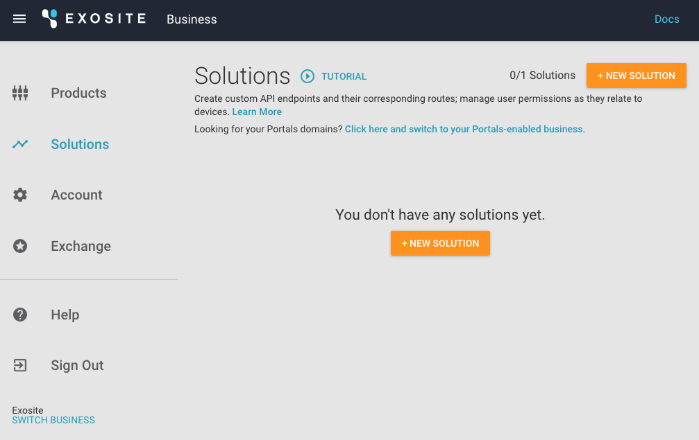

# Getting-started Guide: Prototype or Simulate an HVAC Monitoring and Control System with Murano

This getting-started guide is an interactive tutorial that allows users to learn the core features of Murano from both a hardware and software perspective. You will have the option to prototype or simulate the implementation of an HVAC monitoring system with simple controls using the Murano platform.

```
Watch for the comments in boxes like these! These notes will provide further insight to answer the "whys" along the way and hopefully give you a better idea of how Murano works.
```

# Requirements

## Hardware Setup (Optional)

### SeeedStudio BeagleBone Green Wireless

[https://beagleboard.org/green-wireless](https://beagleboard.org/green-wireless)

SeeedStudio BeagleBone Green (BBG) is a low-cost, open-source, community-supported development platform for developers and hobbyists. It is a joint effort by BeagleBoard.org and Seeed Studio. It is based on the classical open-source hardware design of BeagleBone Black and has been developed into this differentiated version. The BBG includes two Grove connectors, making it easier to connect to the large family of Grove sensors. The onboard HDMI is removed to make room for these Grove connectors.

[http://wiki.seeed.cc/BeagleBone_Green/](http://wiki.seeed.cc/BeagleBone_Green/) 

## Software Setup

### BeagleBone Green

The BBG comes standard with a useful set of software that will enable you to rapidly develop your IoT solution.

* Debian 8.5

* Python

* Node.js

* Node-RED ([http://nodered.org/](http://nodered.org/))

### Gateway Engine with GMQ (Optional)

ExositeReady™ Gateway Engine (GWE) is a Python-based application framework that runs on embedded Linux gateway devices. GWE makes it easy to connect devices to a gateway and write applications on that gateway to interact with Exosite web services, including the Murano platform, Murano Edge, or both.

In this example you will use GWE to allow sensors to communicate with the Murano platform. Installation instructions are provided in a later section.

```
Gateway Engine will be used to provision, or activate your physical hardware. If you intend on using the simulator you will not need to install GWE.
```

### Mr. Murano

Mr. Murano is a command-line utility for working with Murano. Think of it as a way to simplify and automate repetitious tasks for those who are comfortable with the command-line interface. 

[https://github.com/tadpol/MrMurano#mrmurano](https://github.com/tadpol/MrMurano#mrmurano)

### Git

Git is required to check out the source code used in this tutorial. Git is a source control tool widely used in the software industry. 

To install Git on your computer, please visit the link below and follow the instructions.

[https://git-scm.com/downloads](https://git-scm.com/downloads)

### Python 3

All code written for the simulator in this tutorial has been written to work with Python 3, which can be downloaded from the [Python website](https://www.python.org/).

# Getting Started

In this section, you will walk through the process of setting up your account with Murano and preparing to run the simulator or actual hardware. If you have BBG hardware available, you will walk through installing GWE on the BBG, connecting the BBG and its sensors to the Murano platform, and connecting the sensor data to a Murano solution. If you do not have hardware available, you will walk through running the simulator. This should provide you with an easy starting point for connecting devices and creating solutions to visualize and interpret your device's data.

## Create Business

To get started with this tutorial, you will need to create an Exosite account. 

1. If you do not have an Exosite account, you can sign up here ([https://exosite.com/signup/](https://exosite.com/signup/)).

   
   
   

1. Once you have an active account and have logged in, you can navigate to the following URL to see your newly created business [https://www.exosite.io/business/memberships](https://www.exosite.io/business/memberships).

   

1. Click on your business to access your business page. 

```
What is a Business within Murano?

A Business is a virtual space that houses all the products and solutions created by your organization. A Business does not necessarily have to be a real-life company. A business could be a development or testing space for trying out new innovations. The business page is the place to manage your account, user access, products, solutions, billing and payments, and more.

Products and solutions will be explained in later sections.
```

## Create Product

Next, you will need to create a product. The product you create is the virtual representation of the BBG’s physical hardware and sensors that will send data to the Murano platform. To create a new product:

1. Navigate to the following URL. Note: Your product name cannot contain any capital letters. [https://www.exosite.io/business/products](https://www.exosite.io/business/products)

   

1. Select *Start from scratch* and click the "ADD" button. In the next step you can use code to configure your product.

   

```
What is a Product within Murano?

A Product encompasses the device side of Murano. Think of it as a virtual blueprint of definitions that will be applied to each connected device. The definitions will tell each new product device how to talk to Murano. 

Example: If you have a thermometer product, you would want all your new devices to report a temperature back to Murano. When you create a product definition with a temperature, every new device added to that product will contain the temerature alias. The Mr. Murano tool will be used to make this product definition easier to create.
```

## Install Mr. Murano

```
Mr. Murano is the command-line tool that interacts with Murano and makes different tasks easier. Mr Murano makes it easy to deploy code to a solution, import many product definitions at once, set up endpoints and APIs, and more. 
```

Mr. Murano is a Ruby based command-line interface. Mr. Murano will be used to for most actions throughout the rest of this tutorial.

Ruby is most likely already installed on your system. Check to see if Ruby is installed first by opening up a terminal window and typing the following command.  
**Note:** Always copy and paste what comes after the $.

```sh
$ which gem
```

If you see `/usr/bin/gem`, then Ruby is already installed. 

```
If you do not have Ruby installed, the official Ruby docs will help you get it installed:
[https://www.ruby-lang.org/en/documentation/installation/](https://www.ruby-lang.org/en/documentation/installation/) 
```

Once Ruby is installed, install Mr. Murano by running this command:

```sh
$ sudo gem install MrMurano
```

## Check Out BBG HVAC Code

Git is required for this next step. Check if Git is installed by running the command: 

```sh
$ which git
```

```
If you do not have Git installed, the official Git docs will help you get it installed:
[https://git-scm.com/book/en/v2/Getting-Started-Installing-Git](https://git-scm.com/book/en/v2/Getting-Started-Installing-Git)
```

In this step you will use the beaglebone-hvac spec file to configure your product.

The following repository includes everything you need to configure the product you just created and deploy a solution. Get started by checking out the code.

In a terminal window, navigate to your development working directory and execute the following:

```sh
$ git clone https://github.com/exosite/ae-beaglebone-hvac-demo.git
```

Enter your GitHub username and password if prompted.

Run this command:

```sh
$ cd ae-beaglebone-hvac-demo
```

Before continuing you will need to find the ID of the product you created.

1. In Murano select *Products*.

2. Select the product you just created.

3. Copy the Product ID on this page.

   

To configure your product, use the config command of the Mr. Murano tool. This command tells Mr. Murano which product to use. 

```sh
$ mr config product.id <productid>
```

Executing the command below will set the product definition for this example as defined in the `beaglebone-hvac-spec.yaml` file.

```
$ mr product spec push --file spec/beaglebone-hvac-spec.yaml 
```

At this point your product is configured and ready to start receiving data from the BBG or the simulator.

If you would like to review the spec file used to configure your product, it can be viewed at the following URL: [https://github.com/exosite/ae-beaglebone-hvac-demo/blob/master/spec/beaglebone-hvac-spec.yaml](https://github.com/exosite/ae-beaglebone-hvac-demo/blob/master/spec/beaglebone-hvac-spec.yaml)

## Create Solution

Next you need a place to deploy the BBG HVAC solution code. 

1. From the *Solutions* tab (https://www.exosite.io/business/solutions), click "+ NEW SOLUTION." 

   

2. Select *Start from scratch* and click the "ADD" button.

   

Once you have created a solution, you will need to find the Solution ID.

1. In Murano select *Solutions*.

2. Select the solution you just created.

3. Copy the Solution ID on this page.

   

To configure Mr. Murano to work with your newly created solution, use the config command of the Mr. Murano tool.

```sh
$ mr config solution.id <solutionid>
```

```
What is a Solution within Murano?

A solution is a set of static files, modules, eventhandlers, and endpoints for interacting with your device's data and users.
```

## Connect the Product to the Solution

1. In your Murano solution, click on the *SERVICES* tab. 

2. Select *Product*.

3. Select the settings icon. 

4. Select the product(s) you want to include in the solution. 

5. Click "APPLY".

   

## Use Mr. Murano to Sync Code

At this point the product is created and the solution is ready to be deployed. In the BBG HVAC repository directory, you can sync the code base. Ensure you are in the BBG HVAC repository directory and then use the syncup command of Mr. Murano.

```sh
$ cd ae-beaglebone-hvac-demo
```
```sh
$ mr syncup -V
```

```
What is happening when you sync code?

Mr. Murano looks at the directory structure of your local repository and syncs the appropriate files and configurations directly to your solution in Murano. Endpoints, event handles, static files, and modules are synced. If you make changes locally, a syncup command will ensure Murano matches your local changes. If you make changes using the Murano interface, a syncdown will ensure your local repository matches Murano.
```

## Read BeagleBone Documentation

```
If you are not using the BBG hardware, please skip ahead to the Simulator Setup section.
```

The BBG does not come with all the tools needed for reading sensors connected to it. Some initial setup is required to send sensor data to Exosite.

[http://beagleboard.org/static/beaglebone/latest/README.htm](http://beagleboard.org/static/beaglebone/latest/README.htm)

Follow the connection steps to connect to the BeagleBone’s Wi-Fi. The box has an informational sheet with details on how to accomplish this. 

**Note:** After you have connected to Wi-Fi, be sure to write down your device's IP address.

If at some point you want to start over and need to reset your device, the software and steps can be found here:

[http://elinux.org/Beagleboard:BeagleBoneBlack_Debian#microSD.2FStandalone:_.28iot.29_.28BeagleBone.2FBeagleBone_Black.2FBeagleBone_Green.29](http://elinux.org/Beagleboard:BeagleBoneBlack_Debian#microSD.2FStandalone:_.28iot.29_.28BeagleBone.2FBeagleBone_Black.2FBeagleBone_Green.29) 

If you intend to use Node-RED, you can connect at the following address: [http://192.168.11.xxx:1880/](http://192.168.11.xxx:1880/)

If you intend to use Cloud9, you can connect at the following address: [http://192.168.11.xxx:3000/](http://192.168.11.xxx:3000/)

Now, to connect directly to the BBG, you can use ssh. At this point you can update the board to install a few needed libraries. The password for the BBG will be displayed after you initiate the ssh connection.

```sh
$ ssh debian@<IP Address>
$ sudo apt-get update && sudo apt-get upgrade
```

After the upgrade completes, please restart the BBG before continuing the setup process.

```
$ sudo reboot
```

After the reboot, ssh back into the BBG to finish upgrading libraries.

```
$ ssh debian@<IP Address>
$ sudo pip install Adafruit_BBIO --upgrade
$ sudo pip install pyserial --upgrade
$ sudo apt-get install python-smbus
```

## Install GWE with GMQ on BeagleBone

Follow the official documentation to install GWE.

[https://gateway-engine.exosite.io/](https://gateway-engine.exosite.io/)

Write down the MAC address of the BBG for adding the device later.

```
$ ifconfig -a
```

Download, install, and configure GWE onto your gateway.

To download the latest version of the Public Release of GWE, follow these steps:

Navigate to the Gateway Engine Release Packages section and follow the instructions to download Gateway Engine.
Run these commands to copy GWE to your gateway (the actual filename in the command may differ):

```
ssh <USER>@<GATEWAY_IP> "mkdir /opt"
scp GatewayEngine.v1-1-2.tar.gz <USER>@<GATEWAY_IP>:/opt
```

At this point, you have downloaded the latest release of GWE and copied it to your gateway.
Run this command to untar the release package and install GWE onto your gateway:

```
ssh <USER>@<GATEWAY_IP> "cd /opt
   tar zxvf GatewayEngine.v1-1-2.tar.gz
   cd gateway-engine
   ./install.sh"
   ```
   
**Note:** In some Linux environments, you will need to use Super-User permissions to run the installer. In this case, replace the ./install.sh command to:

```
sudo ./install.sh
```

Once the installation completes, you will need to configure GWE for your IoT solution and Exosite account. This will require one piece of information from your Murano account, and you will need to make a decision about what serial number to use for your gateway.

In your Murano account, navigate to your Product and click on the *INFO* tab. Copy the Product ID and use it in the commands, below, in place of <PRODUCT_ID>.

Determine the serial number of your gateway. GWE is programmed to retrieve the MAC address from the Internet interface of your choosing (e.g., eth0, wlan0, ppp0, etc.) when the --set-iface command-line switch is used. Or you can just specify any serial number you want with the --set-uuid command-line switch.

Once you have gathered this information and determined which serial number to use for your gateway (interface MAC address or custom serial number), run the following command to configure GWE:

$ ssh <USER>@<GATEWAY_IP> "gwe --set-product-id <PRODUCT_ID> --set-iface <THE_INTERFACE>""
Note

Example:

$ ssh <USER>@<GATEWAY_IP> "gwe --set-product-id dubhxzv0r4e1m7vj --set-iface eth0"``

Or if you want to just specify your own serial number:

$ ssh <USER>@<GATEWAY_IP> "gwe --set-product-id <PRODUCT_ID> --set-uuid <THE_SERIAL_NUMBER>""
Note

Example:

$ ssh <USER>@<GATEWAY_IP> "gwe --set-product-id dubhxzv0r4e1m7vj --set-uuid 12345"

To complete the installation you will need to reboot the gateway. To reboot, you can toggle the power or use the following command:

$ ssh <USER>@<GATEWAY_IP> "reboot"

Important

Gateway Engine uses supervisord to start itself on boot and once it starts, it will start Gateway Engine as well as all other installed Custom Gateway Applications.

ssh root@<IP Adddress>
ifconfig

## Install Node Modules 

TODO: is this step needed?

```sh
$ npm install -g node-red-contrib-exosite
```

At this point in the tutorial, your device’s software is up to date and ready to connect.

## Simulator Setup

The simulator requires Python 3. You can ensure Python 3 is available on your system by executing the following command.

```sh
$ which python3
```

If Python 3 is not available, please follow the official documentation to get started:
[https://www.python.org/downloads/](https://www.python.org/downloads/)

In the `ae-beaglebone-hvac-demo` folder, install requirements. The only requirement for this simulator is `requests`. The requests library is used for executing HTTP requests to Exosite and the Weather Underground API.

```sh
$ cd ae-beaglebon-hvac-demo
$ pip3 install -r requirements.txt
```

Next you will need to obtain an API key from Weather Underground and configure the product scripts.

Navigate to Weather Underground and log in or sign up for an API key. All plans are free for development use, as such it makes sense to sign up for the ANVIL plan.

[https://www.wunderground.com/weather/api/](https://www.wunderground.com/weather/api/)

Once you obtain your API, add it to the `config.ini` file in the `product` folder.

```
[main]
cik =
wuapi = aen33n5235n235jkjh
```

The CIK value will be automatically added during the activation step below.

## Add Device

1. In Murano select *Products*.

   

2. Select your product.

3. Select *DEVICES*.

   

4. Click "+ NEW DEVICE."

   

5. Add a device with a Name and Identity. The Name can be any string to help remember which device it is. The Identity should either be the MAC address of your BBG, or if you are using the simulator, you can use `00001` for the purpose of testing.

## Enable Serial Number which is the MAC Address of the Device

At this point, you will need to activate your device by either executing a command in GWE, or running the simulator code.

### GWE Activation

The steps to activate your BBG using GWE can be found here:
[http://docs.exosite.com/gwe/getting_started/](http://docs.exosite.com/gwe/getting_started/)

A summarized version of the steps are included here:

```
$ ssh debian@<IP Address>
$ sudo gwe --set-product-id <Product ID> --set-uuid <MAC Address>
$ sudo reboot
```

### Simulator Activation and Execution

```
$ cd product
$ python3 ./hvac-simulaor.py <product_id> <device_id>
```

The script will now pull historical data from the Weather Underground API to simulate weather. The "building" will heat and cool relative to the ambient temperature. After the temperature reaches a certain level, either the AC or HEAT will be activated. Adjustments to the temperature settings can be made from the solution interface in the **NEXT SECTION** section below.

## Coding the sensors

TODO: all the code

## Final Steps

TODO: add final steps. click the solution link. and watch the magic happen.

TODO: add the code needed for this, then explain what the code is doing. 

TODO: add images of interface with details on each section.

There are many other services and features of Murano that were not covered in this example such as users, timeseries databases, email, SMS, and more. Please visit [docs.exosite.com](docs.exosite.com) to explore additional features of Murano.

## Diagrams

  


